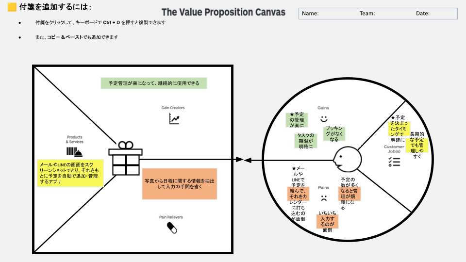

# VPC v1 - inviting_hummingbird_36364

> 「**自分や周りの人を顧客に設定**」したVPC。13週後の自分が欲しいもの・身近な人のために作りたいものを設計する。
> v1 でいい。完璧を目指さない。第6回でアップデート(v2)します。

---

## 1. 解決したい困りごとを 1つ 選ぶ

> [`bug-list.md`](./bug-list.md) の20個から、**「自分が一番これを解決したい!」と思うもの** を1つ選んでください。

**選んだ困りごと**:

* 8. 予定をカレンダーに入れるのが面倒くさい

---

## 2. その解決策のアイデアを書く

> 選んだ困りごとに対する「**こうだったらいいのに**」を1つ書く。
> 現実性は気にせず、自由に発想。

**解決のアイデア**:

* メールやLINEの画面をスクリーンショットでとり、それをもとに予定を自動で追加・管理するアプリ

---

## 3. VPC本体

> 上で選んだ「困りごと」と「解決のアイデア」を起点に、6要素を埋めていきます。

### 🟦 Customer Profile(顧客=自分自身)

#### Jobs(やりたいこと・動詞で書く)

- ★予定を決まったタイミングで明確にする
- 長期的な予定でも管理しやすくする

#### Pains(困っていること)

- ★メールやLINEで予定を組んで、それをカレンダーに打ち込むのが面倒
- いちいち入力するのが面倒
- 予定の数が多くなると管理が煩雑になる

#### Gains(得たい未来・状態)

- ★予定の管理が楽に
- タスクの期限が明確に
- ブッキングがなくなる

---

### 🟧 Value Map(あなたが作るもの)

#### Products & Services

- メールやLINEの画面をスクリーンショットでとり、それをもとに予定を自動で追加・管理するアプリ

#### Pain Relievers

- 写真から日程に関する情報を抽出して入力の手間を省く

#### Gain Creators

- 予定管理が楽になって、継続的に使用できる

---

## 4. Fit確認(整合チェック)

| Pains/Gains | ↔ | Pain Relievers / Gain Creators | チェック |
|---|---|---|---|
| メールやLINEで予定を組んで、それをカレンダーに打ち込むのが面倒 | ↔ | 写真から日程に関する情報を抽出して入力の手間を省く | ✓ |
| いちいち入力するのが面倒 | ↔ | 写真から日程に関する情報を抽出して入力の手間を省く | ✓ |
| 予定の数が多くなると管理が煩雑になる | ↔ | （アプリで自動管理し一元化する） | ✓ |
| 予定の管理が楽に | ↔ | 予定管理が楽になって、継続的に使用できる | ✓ |
| タスクの期限が明確に | ↔ | 予定管理が楽になって、継続的に使用できる | ✓ |
| ブッキングがなくなる | ↔ | （カレンダー自動登録時の重複防止機能など） | ✓ |

> 整合しないものは「自分が作りたいだけ」のプロダクトになりがち。
> 迷ったら AI大学講師に壁打ち。

